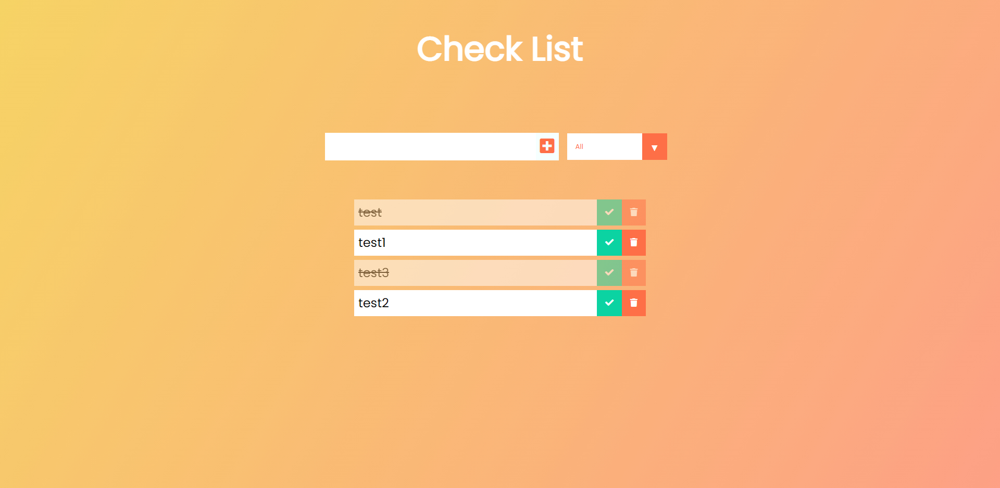
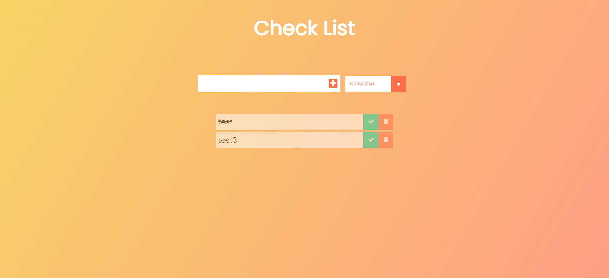
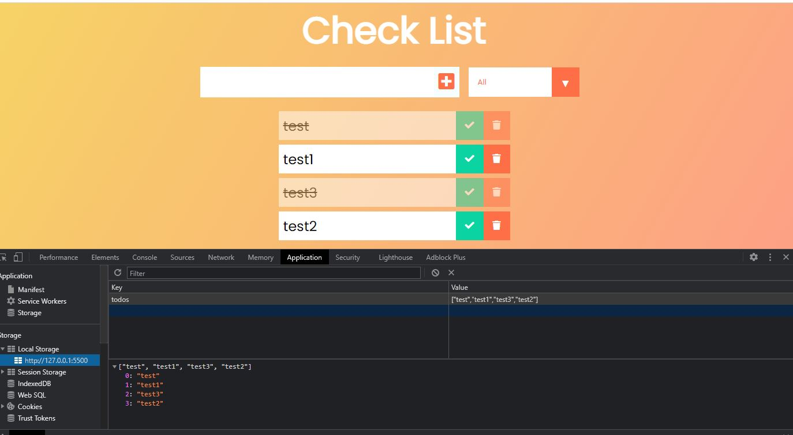

# Check List

This application is a check list application where you can mark the item as a completed or uncompleted. 
You can also view completed items, uncompleted items, or all items together by clicking the selection box. 

# Technology Used
- HTML / CSS
- VANILLA JAVASCRIPT

# Deploy
- Deployed Application:
https://yuniksung.github.io/todo-v2/

- Github Repository: 
https://github.com/yuniksung/todo-v2

# Contributor:
Yunik Sung
yuniksung@gmail.com